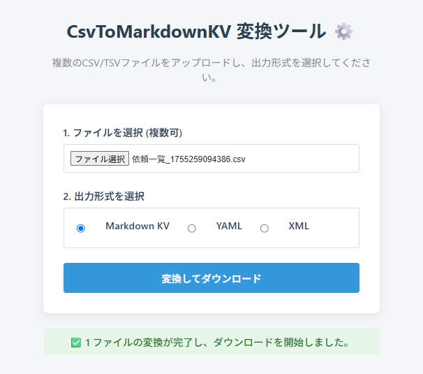

# CsvToMarkdownKV - GAS Web App

CSV/TSVファイルをMarkdown (Key-Value), YAML, XML形式に変換するためのGoogle Apps Script (GAS) 製Webアプリケーションです。

LLM（大規模言語モデル）にデータを与える際、単純なCSV形式よりもKey-Value形式の方が文脈を理解しやすく、精度が向上する傾向があります。このツールは、その変換を手軽に行うことを目的としています。



---

## ✨ 特徴 (Features)

* **多様な出力形式**: Markdown (Key-Value), YAML, XMLへの変換をサポート。
* **複数ファイル対応**: 複数のCSV/TSVファイルを一度にアップロードし、一括で変換できます。
* **文字コード自動判定**: Shift\_JISとUTF-8の文字コードをサーバーサイドで自動的に判別し、文字化けを防ぎます。
* **ファイル名維持**: 変換後のファイル名は、元のファイル名（拡張子を除く）が引き継がれます。
* **デプロイが容易**: Google Apps Scriptの環境があれば、誰でも簡単に自身の環境にデプロイして利用できます。

---

## 🚀 利用方法 (How to Use)

1.  **Google Apps Script プロジェクトの作成**
    * Google Drive を開き、「新規」 > 「その他」 > 「Google Apps Script」を選択して新しいプロジェクトを作成します。

2.  **ファイルの作成とコピー**
    * デフォルトで作成される `コード.gs` の内容を、後述の `Code.gs` のスニペットで上書きします。
    * `ファイル` > `新規作成` > `HTML ファイル` を選択し、以下の4つのHTMLファイルをそれぞれ作成し、後述のスニペットの内容を貼り付けます。
        * `index.html`
        * `javascript.html`
        * `stylesheet.html`

3.  **Webアプリケーションとしてデプロイ**
    * GASエディタ右上の **`デプロイ`** ボタンをクリックし、**`新しいデプロイ`** を選択します。
    * 種類の選択（歯車アイコン⚙）から **`ウェブアプリ`** を選択します。
    * 以下の設定を行います。
        * **説明**: (任意) CsvToMarkdownKV Converterなど
        * **次のユーザーとして実行**: `自分`
        * **アクセスできるユーザー**: `全員`
    * **`デプロイ`** ボタンをクリックします。

4.  **承認プロセス**
    * 初回デプロイ時には「承認が必要です」というダイアログが表示されます。
    * **`アクセスを承認`** ボタンをクリックし、自身のGoogleアカウントを選択します。
    * 「このアプリはGoogleで確認されていません」という警告画面が表示されたら、「詳細」をクリックし、「（プロジェクト名）（安全でないページ）に移動」をクリックして承認を完了します。

5.  **アプリケーションの利用**
    * デプロイが完了すると表示される **ウェブアプリURL** にアクセスすると、本ツールが利用できます。

---

## 📂 ファイル構成 (File Structure)

```
.
├── Code.gs             # サーバーサイドロジック (GAS)
├── javascript.html     # フロントエンドロジック (JavaScript)
├── index.html          # アプリケーションの基本構造 (HTML)
└── stylesheet.html     # アプリケーションのスタイル (CSS)
```

---

## 📄 ライセンス (License)


このプロジェクトは [MIT License](LICENSE) の下で公開されています。
